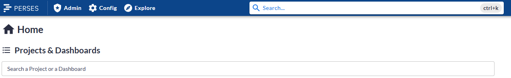
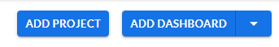
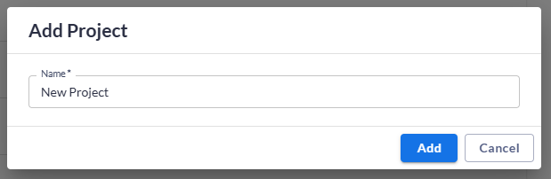
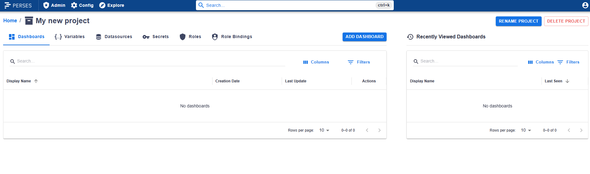
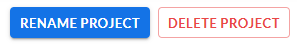

# Project

A project serves as a workspace or namespace where users can create and manage resources such as dashboards, variables, and data sources. Every dashboard must belong to a project. Projects can be either personal or collaborative, depending on the intended usage and access permissions.

## Working with Projects

### Using the UI

You can search among the existing projects using the search bar:

If server permissions allow, you also have the possibility to create your own project:

You will then be redirected to your newly created project workspace.
 
 

Once there you have the options to rename or delete your project.

### Using the CLI

You can create, read, update, or delete projects using the [CLI](../cli.md). Refer to the [Project API documentation](../api/project.md) for details on the data model and available endpoints.

### Project Permissions

When a user creates a project, they are automatically assigned the Owner role for it.
Owners have full control over the project to edit, rename or delete it.
