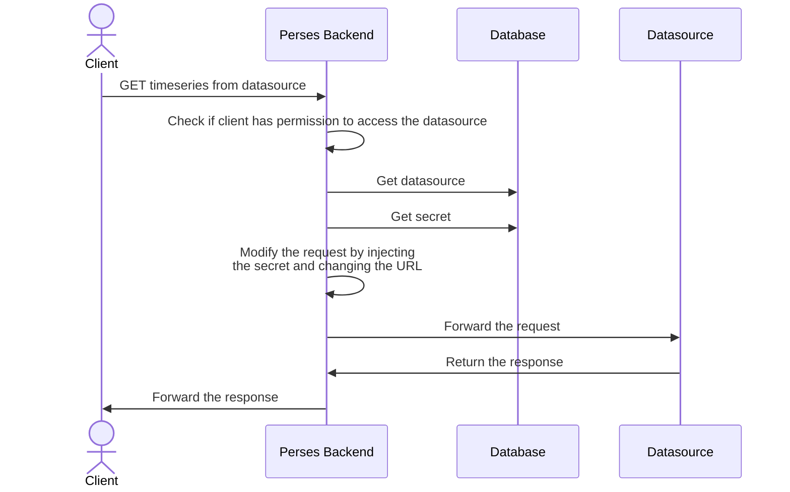
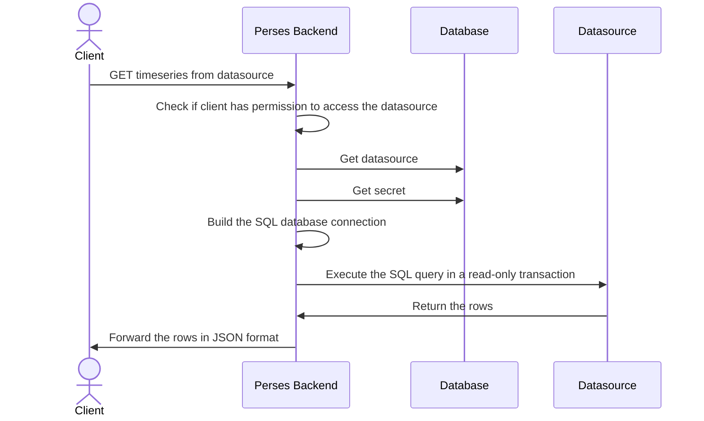

Proxy
=====

Perses can serve as a proxy for various supported datasource types. This is especially useful when:

* The datasource is not accessible from your browser.
* The datasource is protected by an authentication mechanism.

# HTTP Proxy

## How it works

Depending on the datasource scope (Global, Project, Local), the URL to access the datasource will be different.

1. For a global scope, the URL to access a datasource in the global scope is:

```text
/proxy/globaldatasources/<datasource-name>/<datasource_api_path>
```

2. For a project scope, the URL to access a datasource in the project scope is:

```text
/proxy/projects/<project-name>/datasources/<datasource-name>/<datasource_api_path>
```

3. For a local scope, the URL to access a datasource in the local scope is:

```text
/proxy/projects/<project-name>/dashboards/<dashboard-name>/datasources/<datasource-name>/<datasource_api_path>
```

For example, if we have a Prometheus Global datasource named `brometheus`, the following URI will return the Prometheus
config:

```text
/proxy/globaldatasources/brometheus/api/v1/status/config
```

`/api/v1/status/config` is the path to get the Prometheus config if you were contacting the Prometheus API directly.

When contacting one of these URLs, Perses will first get the datasource from the database based on the provided
information in the URI.
Then, if a secret is associated with the datasource, Perses will retrieve the secret from the database and use it to
inject the secret in the request.
Finally, Perses will forward the request to the datasource and return the response to the client.

The HTTP proxy spec supports two optional request header policies:

* `allowHeaders`: forward only the listed headers.
* `dropHeaders`: remove the listed headers and forward the others.

Header names are matched case-insensitively, and all values of retained headers are preserved.
An empty list leaves headers unchanged. Only one list can be configured.
Filtering happens after configured headers, but before secret authentication. No need to allow `Authorization`, as it will be injected after filtering.
Excluding `X-Forwarded-For` also prevents the reverse proxy from adding it.


```mermaid
sequenceDiagram
    actor client as Client
    participant backend as Perses Backend
    participant db as Database
    participant datasource as Datasource
    client ->> backend: GET timeseries from datasource
    backend ->> backend: Check if client has permission to access the datasource
    backend ->> db: Get datasource
    backend ->> db: Get secret
    backend ->> backend: Modify the request by injecting<br/> the secret and changing the URL
    backend ->> datasource: Forward the request
    datasource ->> backend: Return the response
    backend ->> client: Forward the response
```

# SQL Proxy

When using the SQLProxy kind, the Perses server takes the request body from the FE and then executes the query
against the datsource's database.

## How it works

Depending on the datasource scope (Global, Project, Local), the URL to access the datasource will be different.

The difference between the HTTP proxy and SQL proxy is that the URL is pointing to the datsource path only
and the request needs to be `POST`

1. For a global scope, the URL to access a datasource in the global scope is:

```text
/proxy/globaldatasources/<datasource-name>
```

2. For a project scope, the URL to access a datasource in the project scope is:

```text
/proxy/projects/<project-name>/datasources/<datasource-name>
```

3. For a local scope, the URL to access a datasource in the local scope is:

```text
/proxy/projects/<project-name>/dashboards/<dashboard-name>/datasources/<datasource-name>
```

The request JSON body should have the following schema:

```
  {
    "query": "select * from table limit 5"
  }
```  

When contacting one of these URLs, Perses will first get the datasource from the database based on the provided
information in the URI.
Then, if a secret is associated with the datasource, Perses will retrieve the secret from the database and use it to
inject the secret in the request.
Finally, Perses will execute the query to the SQL datasource and return the response in JSON format to the client.

## Read-only queries

The SQL proxy only executes read-only queries:

- The query must start with one of the following keywords: `SELECT`, `WITH`, `SHOW`, `DESCRIBE`, `DESC`, `EXPLAIN`, `VALUES`, `TABLE`.
  Any other query is rejected.
- The query must not contain `INTO OUTFILE` or `INTO DUMPFILE`, which would write a file on the database server (MySQL / MariaDB, with the `FILE` privilege).
- The query is executed in a read-only transaction, so the database rejects any statement modifying the data or the schema of the database,
  even when the query starts with one of the keywords above (e.g. `WITH d AS (DELETE FROM ...) SELECT ...`).
  The database must support read-only transactions (`START TRANSACTION READ ONLY` for MySQL / MariaDB, `BEGIN READ ONLY` for PostgreSQL).
  It may not be the case of a database that is only compatible with the MySQL or PostgreSQL protocol: every query then fails.
- A single statement is executed per query.

These checks are a safety net, not a security boundary. A read-only transaction doesn't prevent the side effects happening
outside the tables of the database, for example:

- writing a file on the database server (`SELECT ... INTO OUTFILE` in MySQL / MariaDB, with the `FILE` privilege). Such queries are rejected by the SQL proxy,
- the file-reading functions in PostgreSQL (`pg_read_file`, `pg_ls_dir`, `pg_read_binary_file`, with the `pg_read_server_files` role), which read files on the database server,
- the administration functions (e.g. `pg_terminate_backend` or `pg_reload_conf` in PostgreSQL),
- the functions acting through another connection (e.g. `dblink_exec` in PostgreSQL).

It is still strongly recommended to configure the datasource with a database user having only the permissions it needs
(e.g. read-only access to the relevant tables, without the `FILE` privilege or any administration role).



```mermaid
sequenceDiagram
    actor client as Client
    participant backend as Perses Backend
    participant db as Database
    participant datasource as Datasource
    client ->> backend: GET timeseries from datasource
    backend ->> backend: Check if client has permission to access the datasource
    backend ->> db: Get datasource
    backend ->> db: Get secret
    backend ->> backend: Build the SQL database connection 
    backend ->> datasource: Execute the SQL query in a read-only transaction
    datasource ->> backend: Return the rows
    backend ->> client: Forward the rows in JSON format
```

# CloudWatch Proxy

When using the CloudWatchProxy kind, the Perses server queries [Amazon CloudWatch](https://aws.amazon.com/cloudwatch/)
on behalf of the client. The requests are signed by the server with the AWS SDK, so the AWS credentials are never sent to
the browser, and the datasource doesn't contain any credential:

```yaml
kind: Datasource
metadata:
  name: cloudwatch
  project: production
spec:
  plugin:
    kind: CloudWatchDatasource
    spec:
      proxy:
        kind: CloudWatchProxy
        spec:
          region: us-east-1
          # Optional: the IAM role assumed by the server. Without it, the server uses its own AWS identity.
          roleArn: arn:aws:iam::123456789012:role/perses-cloudwatch-read
          # Optional, only with roleArn: the name of the secret holding the external ID in `authorization.credentials`.
          externalIdSecret: cloudwatch-external-id
```

## Server policy

The CloudWatch proxy is disabled by default. An administrator enables it and lists the regions, accounts and roles
the datasources can use in the `datasource.cloudwatch` section of the [configuration](../configuration/configuration.md#cloudwatch-config):

```yaml
datasource:
  cloudwatch:
    enable: true
    allow_default_credentials: false
    allowed_regions: [us-east-1]
    allowed_accounts: ["123456789012"]
    allowed_roles:
      - arn:aws:iam::123456789012:role/perses-cloudwatch-read
```

- The server identity comes from the default credential chain of the AWS SDK (environment, web identity, ECS, EC2 instance metadata).
- A datasource without `roleArn` uses the server identity directly. It requires `allow_default_credentials: true`.
- A role must be listed in `allowed_roles`, and its account in `allowed_accounts`. Wildcards are not supported.
- The account of the identity used for the requests is verified with `sts:GetCallerIdentity` when its AWS client is created.
  The client and its credentials are then reused for 5 minutes, after which the account is verified again.
- The identity used to query CloudWatch only needs `cloudwatch:GetMetricData` and `cloudwatch:ListMetrics`.
  When a role is used, the server identity needs `sts:AssumeRole` on it, and the role must trust the server identity.

The allowlists apply to the whole server: every user allowed to create or query a project or global datasource can use them.
CloudWatch datasources can't be defined in a dashboard (local scope), because anyone allowed to edit the dashboard could
then choose the role. Use separate Perses instances, or separate AWS identities, for tenants that must not see the metrics of each other.

## How it works

The request must be a `POST` on the datasource path, without any sub-path or URL parameter:

1. For a global scope:

```text
/proxy/globaldatasources/<datasource-name>
```

2. For a project scope:

```text
/proxy/projects/<project-name>/datasources/<datasource-name>
```

The JSON body defines the action. `GetMetricData` queries metrics and supports metric math:

```json
{
  "action": "GetMetricData",
  "startTime": "2026-09-30T10:00:00Z",
  "endTime": "2026-09-30T11:00:00Z",
  "queries": [
    {
      "id": "m1",
      "metric": {
        "namespace": "AWS/EC2",
        "name": "CPUUtilization",
        "dimensions": {"InstanceId": "i-0123456789abcdef0"},
        "statistic": "Average",
        "period": 60
      },
      "returnData": false
    },
    {"id": "e1", "expression": "m1 * 2", "label": "CPU x2"}
  ]
}
```

It returns the queries with `returnData` (`true` by default), with RFC 3339 timestamps:

```json
{"MetricDataResults": [{"Id": "e1", "Label": "CPU x2", "Timestamps": ["2026-09-30T10:00:00Z"], "Values": [42], "StatusCode": "Complete"}]}
```

The pages returned by AWS are merged by the server. A query whose result is partial, forbidden or missing fails,
rather than returning incomplete data.

`ListMetrics` discovers the metrics of a namespace, optionally filtered by metric name and dimension values:

```json
{"action": "ListMetrics", "namespace": "AWS/EC2", "metricName": "CPUUtilization", "dimensions": {"InstanceId": "i-0123456789abcdef0"}}
```

```json
{"Metrics": [{"Namespace": "AWS/EC2", "MetricName": "CPUUtilization", "Dimensions": [{"Name": "InstanceId", "Value": "i-0123456789abcdef0"}]}], "Truncated": false}
```

At most 1000 metrics are returned. `Truncated` is `true` when more metrics match: use the filters to narrow the discovery.

## Limits

- Body of 64 KiB at most, 1 to 20 queries with unique IDs, 30 dimensions at most.
- Time range of 31 days at most, starting in the last 455 days, and not in the future (5 minutes of clock skew are accepted).
- Periods from 60 to 86400 seconds, in multiples of 60.
- Statistics: `Average`, `Sum`, `Minimum`, `Maximum`, `SampleCount` and the percentiles `p0` to `p100`.
- Metric math: arithmetic and comparison operators, and the functions `ABS`, `CEIL`, `FLOOR`, `IF`, `FILL`, `RATE`, `DIFF`,
  `DIFF_TIME`, `MIN`, `MAX`, `SUM` and `AVG` (upper case). `SEARCH`, Metrics Insights queries and Lambda functions are rejected.
- 10000 datapoints for all the returned queries. A request that would return more is rejected before querying AWS,
  with a `400` asking to increase the period or reduce the time range. For example, a 7-day range needs a period of at least 2 minutes for a single metric.
- 8 MiB per AWS response, and 30 seconds per request including the credentials and the retries.
- 16 concurrent requests per server, and 4 per AWS identity (region, role and external ID).

Errors are logged by the server with their cause. The client gets a generic message, with the status `400` for an invalid request,
`413` for a body that is too large, `429` when AWS throttles the requests, `504` on timeout, and `502` otherwise.
