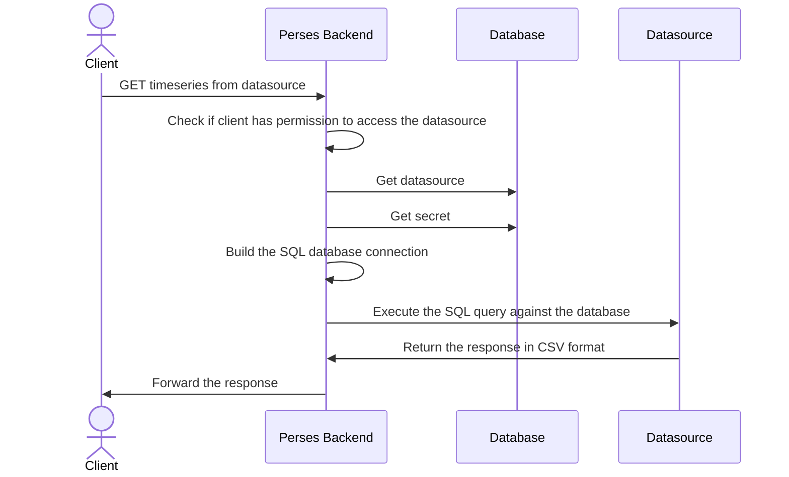

Proxy
=====

Perses can serve as a proxy for various supported datasource types. This is especially useful when:

* The datasource is not accessible from your browser.
* The datasource is protected by an authentication mechanism.

# HTTP Proxy

## How it works

Depending on the datasource scope (Global, Project, Local), the URL to access the datasource will be different.

1. For a global scope, the URL to access a datasource in the global scope is:

```text
/proxy/globaldatasources/<datasource-name>/<datasource_api_path>
```

2. For a project scope, the URL to access a datasource in the project scope is:

```text
/proxy/projects/<project-name>/datasources/<datasource-name>/<datasource_api_path>
```

3. For a local scope, the URL to access a datasource in the local scope is:

```text
/proxy/projects/<project-name>/dashboards/<dashboard-name>/datasources/<datasource-name>/<datasource_api_path>
```

For example, if we have a Prometheus Global datasource named `brometheus`, the following URI will return the Prometheus
config:

```text
/proxy/globaldatasources/brometheus/api/v1/status/config
```

`/api/v1/status/config` is the path to get the Prometheus config if you were contacting the Prometheus API directly.

When contacting one of these URLs, Perses will first get the datasource from the database based on the provided
information in the URI.
Then, if a secret is associated with the datasource, Perses will retrieve the secret from the database and use it to
inject the secret in the request.
Finally, Perses will forward the request to the datasource and return the response to the client.


# SQL Proxy

When using the SQLProxy kind, the Perses server takes the request body from the FE and then executes the query
against the datsource's database.

## How it works

Depending on the datasource scope (Global, Project, Local), the URL to access the datasource will be different.

The difference between the HTTP proxy and SQL proxy is that the URL is pointing to the datsource path only
and the request needs to be `POST`

1. For a global scope, the URL to access a datasource in the global scope is:

```text
/proxy/globaldatasources/<datasource-name>
```

2. For a project scope, the URL to access a datasource in the project scope is:

```text
/proxy/projects/<project-name>/datasources/<datasource-name>
```

3. For a local scope, the URL to access a datasource in the local scope is:

```text
/proxy/projects/<project-name>/dashboards/<dashboard-name>/datasources/<datasource-name>
```

The request JSON body should have the following schema:

```
  {
    "query": "select * from table limit 5"
  }
```  

When contacting one of these URLs, Perses will first get the datasource from the database based on the provided
information in the URI.
Then, if a secret is associated with the datasource, Perses will retrieve the secret from the database and use it to
inject the secret in the request.
Finally, Perses will execute the query to the SQL datasource and return the response in CSV format to the client.



