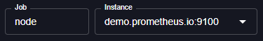

# Variable

A **variable** in Perses is a dynamic configuration element that allows you to create interactive and reusable dashboards. Variables act as parameters that can be modified by users to filter data, change query scopes, or customize dashboard views without editing the underlying dashboard configuration.



## Variable types

Perses supports several types of variables to meet different use cases:

- **Text Variable** – for static string values that can be constant or user-editable.
- **List Variable** – for dynamic dropdown selections, powered by [plugins](./plugin.md).

## Configuring variables

Variables are generally defined as part of a dashboard, but you also have the option to configure them at higher scopes for reusability. More details about scopes at [Datasource & Variable scopes](./datasource-and-variable-scopes.md).

## Using variables

Once defined, variables can be used in places like:

- **Query expressions**.
- **Other variables** to create cascading dropdowns where one variable filters another.
- **Panel titles and descriptions**.

Variables can be referenced using one of the following syntax:
- `$variableName`
- `${variableName}`
- `${variableName:format}`: this allows to define custom interpolation formats.

### Variables interpolation

The format syntax `${variableName:format}` allows you to define custom interpolation. The following formats are supported:

- default format

  ```
  pair: ['perses', 'prometheus']

  "${pair}"
  => "(perses|prometheus)"
  ```

- `csv`: Comma-separated values

  ```
  superheroes: ['perses', 'prometheus']

  "Who saves the monitoring world? ${superheroes:csv}!"
  => "Who saves the monitoring world? perses,prometheus!"
  ```

- `distributed`: Distributed format for key=value pairs

  ```
  metrics: ['perses', 'prometheus']

  "The dream team: ${metrics:distributed}"
  => "The dream team: perses,metrics=prometheus"
  ```

- `doublequote`: Double-quoted strings

  ```
  databases: ['perses', 'prometheus']

  "My favorite tools are ${databases:doublequote}"
  => "My favorite tools are \"perses\",\"prometheus\""
  ```

- `glob`: Glob pattern matching

  ```
  services: ['perses', 'prometheus']

  "Find all services: ${services:glob}"
  => "Find all services: {perses,prometheus}"
  ```

- `json`: JSON array format

  ```
  platforms: ['perses', 'prometheus']

  "Available platforms: ${platforms:json}"
  => "Available platforms: [\"perses\",\"prometheus\"]"
  ```

- `lucene`: Lucene query syntax

  ```
  tools: ['perses', 'prometheus']

  "${tools:lucene}"
  => "(perses OR prometheus)"
  ```

- `percentencode`: Percent-encoded (URL-encoded) format

  ```
  names: ['perses the great', 'prometheus & fire']

  "search?q=${names:percentencode}"
  => "search?q=perses%20the%20great,prometheus%20%26%20fire"
  ```

- `pipe`: Pipe-separated values

  ```
  monitoring_stack: ['perses', 'prometheus']

  "The ultimate stack: ${monitoring_stack:pipe}"
  => "The ultimate stack: perses|prometheus"
  ```

- `raw`: Raw format (no escaping)

  ```
  raw_data: ['perses*', 'prometheus+']

  "${raw_data:raw}"
  => "perses*prometheus+"
  ```

- `regex`: Regular expression format

  ```
  patterns: ['perses.chart', 'prometheus']

  "${patterns:regex}"
  => "(perses\.chart|prometheus)"
  ```

- `singlequote`: Single-quoted strings

  ```
  favorites: ['perses', 'prometheus']

  "My picks: ${favorites:singlequote}"
  => "My picks: 'perses','prometheus'"
  ```

- `sqlstring`: SQL string format

  ```
  tools: ['perses', 'prometheus']

  "SELECT * FROM tools WHERE name IN (${tools:sqlstring})"
  => "SELECT * FROM tools WHERE name IN ('perses','prometheus')"
  ```

- `text`: Plain text format

  ```
  projects: ['perses', 'prometheus']

  "Working on ${projects:text} rocks!"
  => "Working on perses + prometheus rocks!"
  ```

- `queryparam`: Query parameter format

  ```
  filters: ['perses', 'prometheus']

  "/api/data?filter=${filters:queryparam}"
  => "/api/data?filter=perses&filter=prometheus"
  ```
