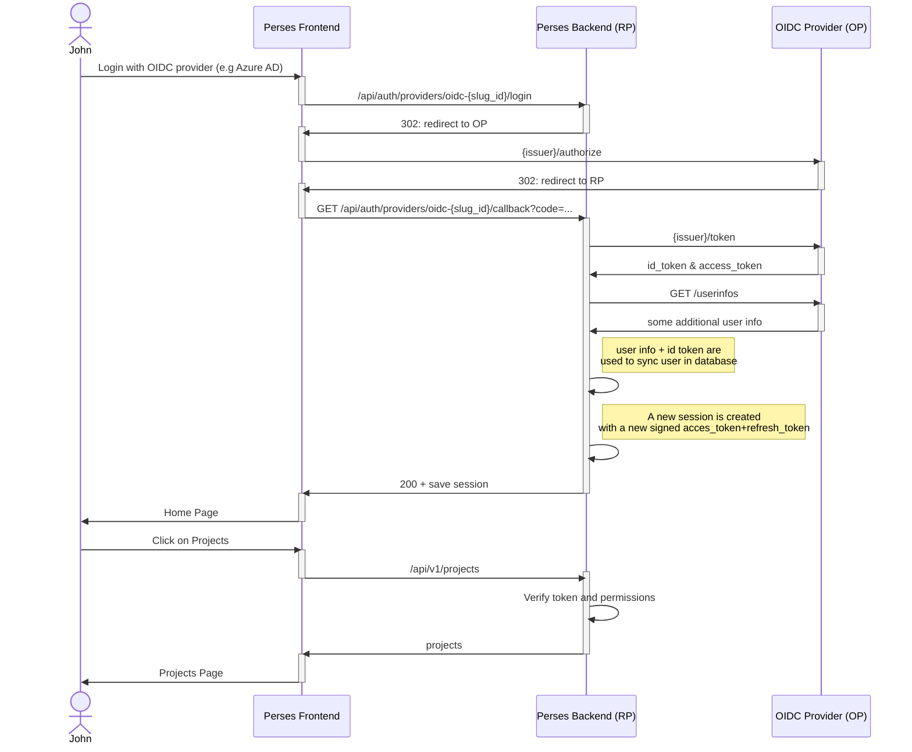
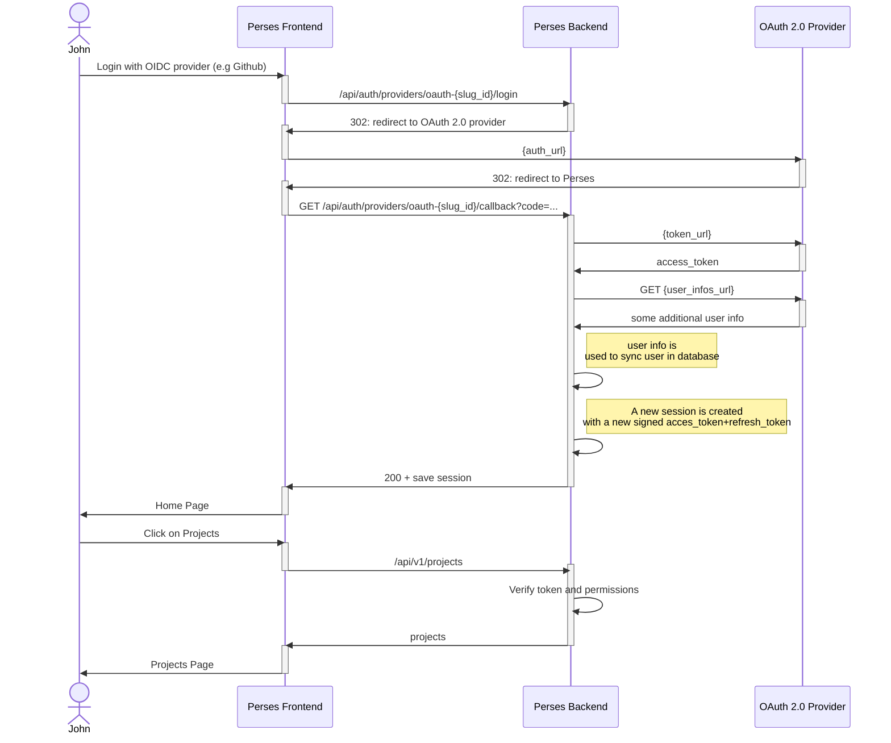

# Authentication

Perses has various authentication flows configurable. You can choose to authenticate from a
[native provider](./authentication.md#native-provider) that will allow you to create some users,
or else rely on an external [identity provider](./authentication.md#external-oidcoauth-providers).

In both cases
- each new user will be saved in the Perses database. 
- at login time, a Perses session (access_token/refresh_token) will be created

Please note that the number of identity providers is not limited.
```yaml
authentication:
  providers:
    # Enable or not the native Perses identity provider
    enable_native: true/false
    # Register one or several OIDC provider(s)
    oidc: []
    # Register one or several OAuth provider(s)
    oauth: []
```
## Native provider

In case a native provider is used, the users and their password are stored in the Perses database.

Login is done through http POST on /api/auth/providers/native/login.

## External OIDC/OAuth provider(s)

It is possible to configure Perses to sign in user with an external identity provider supporting OIDC/Oauth.
For both of these provider's types, the flow is quite similar:

When a user sign in with an external provider (e.g. Github) the Perses backend will then use the information
collected (email, firstname, lastname, picture) to **sync the user in database**.
Then the backend takes in charge the creation of the access_token/refresh_token that will be used to
authenticate this user in the subsequent requests.

> The **user synchronization** can possibly be used to update also its [permissions](./authorization.md), based on
> some roles/groups present in the external idp's token.
>
> At the time we write this documentation, there is nothing implemented yet. User have to login first and ask specific
> permissions to an admin.

### => Configuration example
```yaml
  authentication:
    providers:
      oidc:
      # Example with an Azure AD OIDC configuration
      - slug_id: azure
        name: "Azure AD"
        client_id: "<secret>"
        client_secret: "<secret>"
        issuer: "https://login.microsoftonline.com/<tenant-id>/v2.0"
        redirect_uri: "http://localhost:3000/api/auth/providers/oidc-azure/callback"
        scopes: ["openid", "profile", "email", "User.read"]
      oauth:
      - slug_id: github
        name: "Github"
        client_id: "<secret>"
        client_secret: "<secret>"
        auth_url: "https://github.com/login/oauth/authorize"
        token_url: "https://github.com/login/oauth/access_token"
        logout_url: "https://github.com/login/oauth/logout"
        redirect_uri: "http://localhost:3000/api/auth/providers/oauth-github/callback"
        user_infos_url: "https://api.github.com/user"
```
### => Login from external OIDC provider


### => Login from external OAuth 2.0 provider

