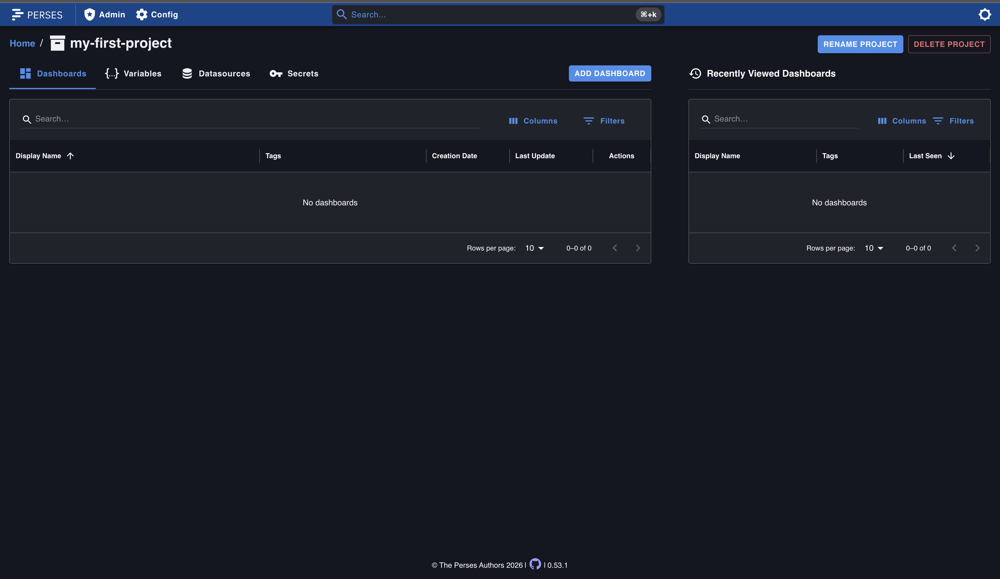
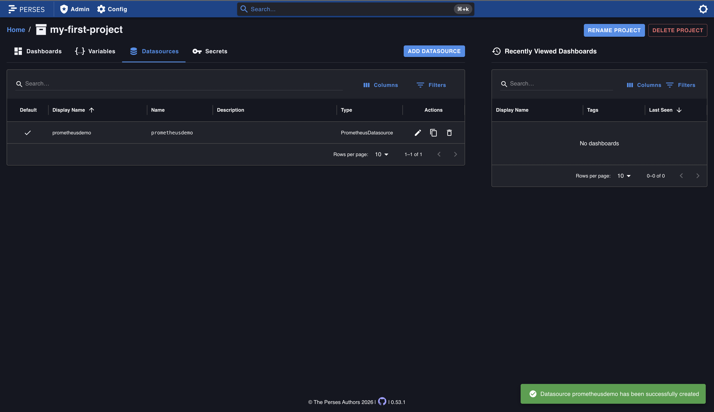
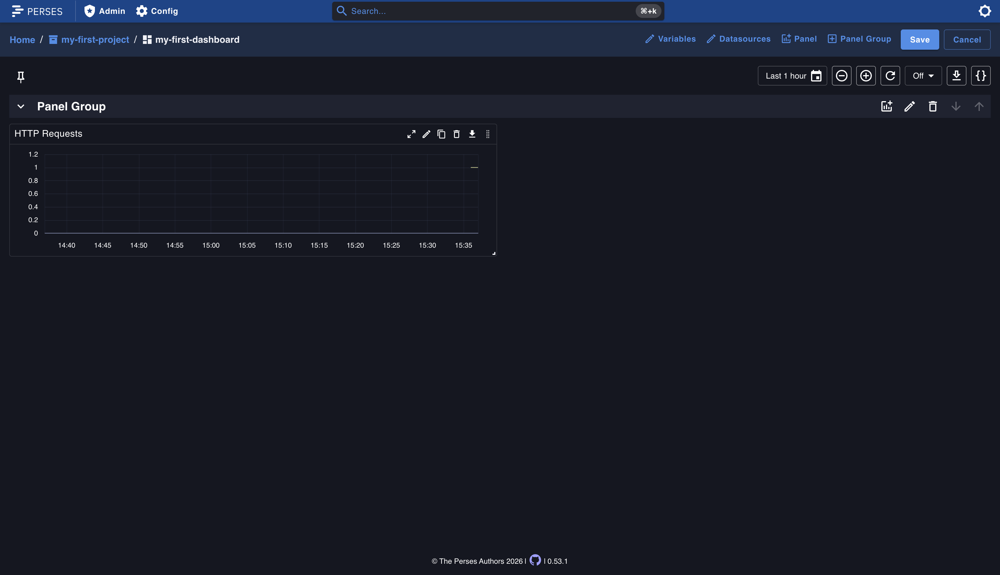
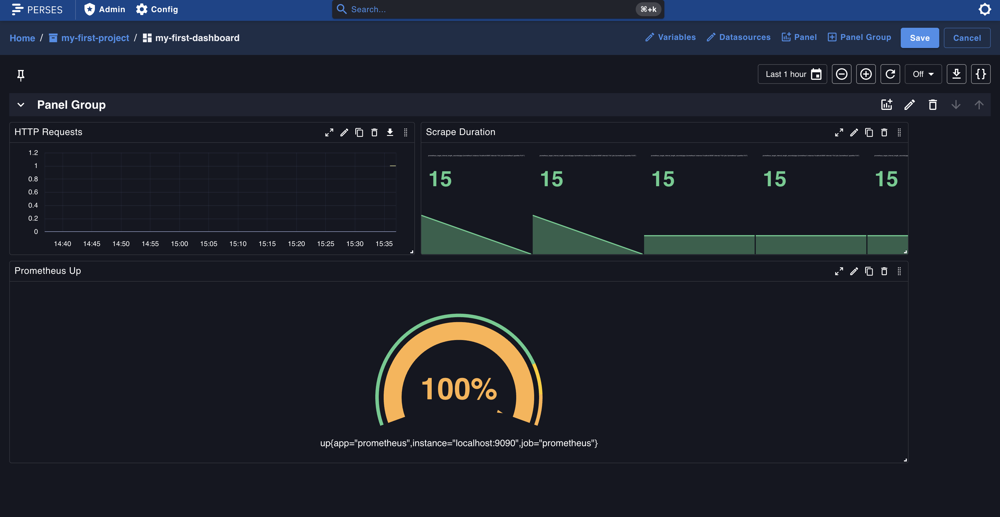
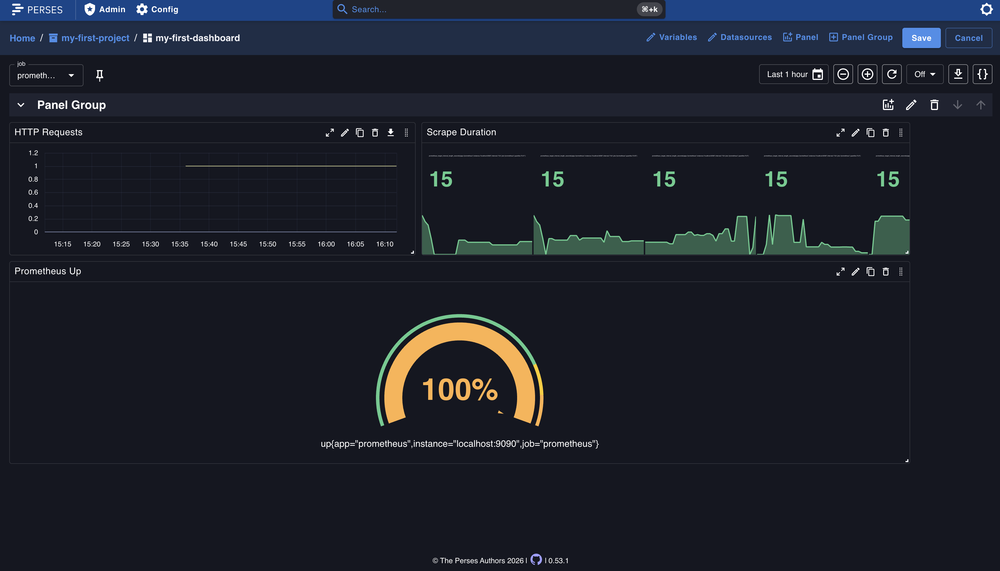

# Getting Started

!!! info
    This guide assumes no prior experience with Perses. For a high-level understanding of the project, see the [Overview](./overview.md).

## Install Perses

Before you begin, you need a running Perses server. Choose the installation method that best fits your environment:

- [Run in a container](./installation/in-a-container.md)
- [Build from source](./installation/from-source.md)
- [Third-party installations](./installation/third-party.md)

You will also need a running Prometheus instance that Perses can connect to.

For this tutorial, the quickest way to get both Perses and Prometheus running together is with Docker Compose. Save the following as `docker-compose.yml`:

```yaml
services:
  perses:
    image: persesdev/perses
    ports:
      - "8080:8080"
  prometheus:
    image: prom/prometheus
    ports:
      - "9090:9090"
```

Then start both services:

```bash
docker compose up -d
```

Perses is now available at [http://localhost:8080](http://localhost:8080) and Prometheus at [http://localhost:9090](http://localhost:9090). Because both containers run on the same Compose network, Perses can reach Prometheus at `http://prometheus:9090`.

## Your First Dashboard

In this section you will create a [project](./concepts/project.md), configure a [datasource](./concepts/datasource.md), and build your first [dashboard](./concepts/dashboard.md).

### Create a Project

A project is the top-level container for dashboards, datasources, and variables.

1. On the home page, click **+ Create**.
2. Enter a name for your project, for example `my-first-project`.
3. Click **Add** to create the project.

You are taken to the project page with tabs for **Dashboards**, **Variables**, **Datasources**, and **Secrets**.



### Add a Datasource

Before you can visualize data, you need to connect Perses to a datasource.

1. Navigate to the **Datasources** tab in your project.
2. Click **Add Datasource**.
3. Fill in the following fields:
    - **Name**: a name for your datasource, for example `PrometheusDemo`.
    - **Set as default**: toggle on.
    - **Source**: select `Prometheus Datasource`.
    - **HTTP Settings**: select `Proxy`.
    - **URL**: the URL of your Prometheus instance, for example `http://prometheus:9090`.
4. Click **Add** to save.

!!! tip
    Use **Proxy** mode so the Perses server forwards requests to Prometheus on your behalf. This avoids CORS issues that occur with **Direct access** mode when the browser cannot reach Prometheus directly.



### Create a Dashboard

1. Navigate to the **Dashboards** tab in your project.
2. Click **Add Dashboard**.
3. Enter a name, for example `my-first-dashboard`.
4. Click **Add** to create the dashboard.

You are taken to an empty dashboard in edit mode.

### Add a Panel

1. Click **Add Panel** in the top-right toolbar.
2. Fill in the following fields:
    - **Name**: `HTTP Requests`
    - **Type**: `Time Series Chart`
3. Under **Query**, configure:
    - **Query Type**: `Prometheus Time Series Query`
    - **Prometheus Datasource**: your default datasource is pre-selected.
    - **PromQL Expression**: `up`
4. Click **Run Query** to preview the chart. You should see a time series line showing the `up` metric.
5. Click **Add** to add the panel to your dashboard.
6. Click **Save** in the top-right corner to persist your dashboard.

You now have a working dashboard with a time series panel showing live data from Prometheus.



## Exploring Plugins

Perses is extensible through [plugins](./concepts/plugin.md). Each datasource type and visualization type is implemented as a plugin.

The dashboard you built in the previous section uses a **Time Series Chart**, but Perses supports several other panel types out of the box. Try adding more panels to see different ways to visualize your data.

### More Panel Types

Open your dashboard in edit mode and click **Add Panel**. In the **Type** dropdown you will find options such as:

- **Gauge Chart** — displays a single value as a gauge. Try the query `up` to see a gauge showing 100% when the target is healthy.
- **Stat Chart** — displays one or more values with an optional sparkline. Try the query `prometheus_target_interval_length_seconds` to see the scrape interval for each target.
- **Markdown** — renders static Markdown text, useful for adding documentation or notes to a dashboard.

Each panel type is a plugin. For the full list of available plugins and their options, see the [plugin documentation](./concepts/plugin.md).



### Variables

[Variables](./concepts/variable.md) let you create dynamic, reusable dashboards. A variable appears as a dropdown at the top of the dashboard and can be referenced in queries using the `$variable_name` syntax.

To create a variable:

1. Open your dashboard in edit mode.
2. Click **Variables** in the top toolbar.
3. Click **+ Add Variable**.
4. Fill in:
    - **Name**: `job`
    - **Source**: select `Prometheus Label Values`.
    - **Label Name**: `job`
5. Click **Run Query** to preview the values. You should see the available `job` label values from Prometheus.
6. Click **Add** to save the variable.
7. Click **Apply** to return to the dashboard.

A dropdown appears at the top of the dashboard. You can now use `$job` in any panel query to filter by the selected value, for example `up{job="$job"}`.



## Dashboard as Code

Once you are comfortable creating dashboards through the UI, you can manage them as code for version control and automation. Perses supports Dashboard-as-Code with SDKs for both CUE and Go.

- [Getting started with Dashboard-as-Code](./dac/getting-started.md)
- [Dashboard-as-Code concept](./concepts/dashboard-as-code.md)

## Next Steps

- Dive deeper into [Concepts](./concepts/dashboard.md)
- Explore the [CLI](./cli.md)
- Check the [API documentation](./api)
