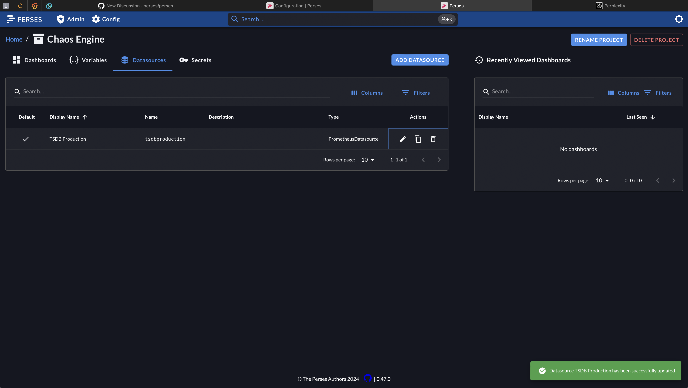
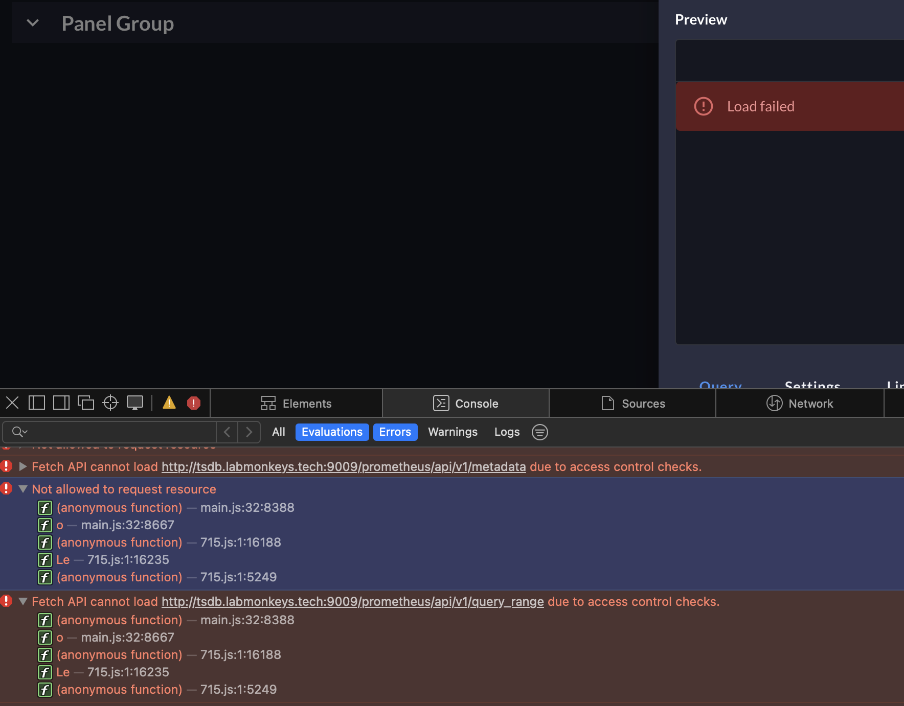
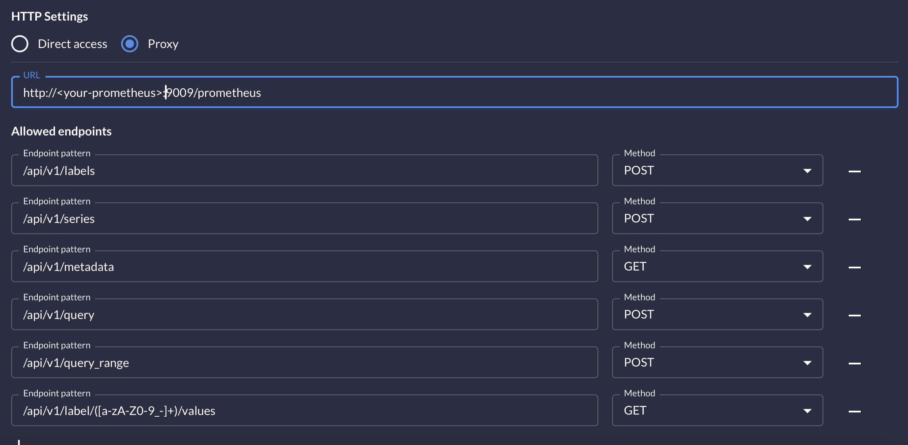

# TLS and plain HTTP datasource

When you run Perses using TLS and your time series backend with Prometheus is just plain HTTP you can configure the data source with the "HTTP Settings: Direct access".
Saving the data source is indicated successfully.
When you try now to create some dashboards you will see a "Load failed" error message without further indication of what the real problem is.

## Diagnostics

When you use the browser inspector and look at the JavaScript console output you will find the error message: "Fetch API cannot load http://:9009/prometheus/api/v1/guery_range due to access control checks."

## Solution

If you have a requirement to run Perses and Prometheus in a mixed HTTPS/HTTP mode you need to configure Perses as a Proxy for the fetch queries.

