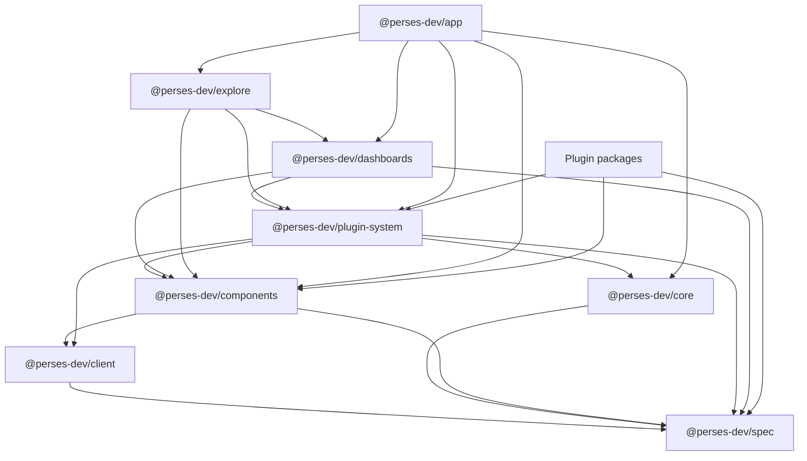

# UI package architecture

Perses UI is split across multiple npm packages so features can be reused, embedded, and extended independently. This page describes the role of each package, how they relate to each other, and the dependency structure between them.

The UI code lives in two Git repositories:

- [`perses/perses`](https://github.com/perses/perses): the main application and legacy shared utilities under `ui/`
- [`perses/shared`](https://github.com/perses/shared): publishable feature libraries consumed by the app, plugins, and external integrators

Official plugins live in a third repository: [`perses/plugins`](https://github.com/perses/plugins).

## Package overview

| Package | Repository | Published | Role |
| --- | --- | --- | --- |
| `@perses-dev/app` | `perses/perses` | No | Main Perses web application (routing, admin pages, API clients, project management) |
| `@perses-dev/core` | `perses/perses` | Yes (deprecated) | **Deprecated.** Legacy shared types and utilities. Use `@perses-dev/spec` and `@perses-dev/client` instead |
| `@perses-dev/spec` | External npm | Yes | Open dashboard and plugin specification types (data models shared across UI, API, and DaC) |
| `@perses-dev/client` | `perses/shared` | Yes | HTTP client helpers, fetch utilities, and API-facing types built on top of `@perses-dev/spec` |
| `@perses-dev/components` | `perses/shared` | Yes | Reusable UI components (dialogs, tables, editors, formatting controls) |
| `@perses-dev/plugin-system` | `perses/shared` | Yes | Plugin runtime, registry, datasource/variable providers, and module federation host |
| `@perses-dev/dashboards` | `perses/shared` | Yes | Dashboard viewing and editing experience |
| `@perses-dev/explore` | `perses/shared` | Yes | Explore view for ad-hoc querying across datasources |
| Plugin packages (e.g. `@perses-dev/prometheus-plugin`) | `perses/plugins` | Yes | Datasource, panel, query, and variable implementations |

Internal packages in `perses/perses/ui` (`e2e`, `internal-utils`) support development and testing. They are not published and are not part of the runtime dependency graph.

## Dependency structure

At a high level, packages are layered from specification types up to the application:

### Foundation layer

- **`@perses-dev/spec`**: canonical TypeScript types for dashboard specs, panel definitions, variables, datasources, and query results. This is the language-neutral contract Perses is built around. See [Open specification](./concepts/open-specification.md).
- **`@perses-dev/client`**: shared HTTP and API helpers used by UI packages when talking to the Perses backend.
- **`@perses-dev/core`** (deprecated): legacy shared types and helpers still consumed by the app and temporarily exposed to plugins through module federation. Do not use in new code — prefer `@perses-dev/spec` and `@perses-dev/client`.

### Feature libraries (`perses/shared`)

- **`@perses-dev/components`**: low-level UI building blocks shared across features and plugins.
- **`@perses-dev/plugin-system`**: plugin loading, registration, runtime state (time range, variables, datasources), and editors used by dashboards and explore.
- **`@perses-dev/dashboards`**: dashboard providers, panel rendering, editing flows, and related utilities.
- **`@perses-dev/explore`**: the Explore feature, built on top of dashboards and plugin-system.

Feature packages depend downward: `explore` → `dashboards` → `plugin-system` → `components` → `spec` / `client`.

### Application layer

- **`@perses-dev/app`**: composes the feature libraries into the full Perses product UI. It also contains app-specific code such as authentication, administration, project/folder management, and REST clients for Perses resources.

### Plugin packages

Plugins are separate npm packages that implement Perses plugin interfaces (datasource, panel, query, variable, explore, and so on). They typically depend on:

- `@perses-dev/plugin-system` for plugin APIs and runtime hooks
- `@perses-dev/components` for shared UI controls
- `@perses-dev/spec` for type definitions

Remote plugins loaded through module federation receive shared copies of these packages from the host runtime configured in `@perses-dev/plugin-system`.

## How packages relate in practice

### Viewing or editing a dashboard

1. `@perses-dev/app` renders a route and loads project context.
2. `@perses-dev/dashboards` provides dashboard providers and layout/panel rendering.
3. `@perses-dev/plugin-system` resolves datasource and variable state, then loads the panel plugin implementation.
4. Plugin packages fetch data and render visualizations using types from `@perses-dev/spec`.

### Embedding Perses in another React app

Integrators can depend directly on published packages such as `@perses-dev/dashboards`, `@perses-dev/plugin-system`, and `@perses-dev/components` without pulling in the full app. See [Embedding panels](./embedding-panels.md).

### Dashboard-as-Code and the backend

- TypeScript and Cue SDKs align with the same models described in `@perses-dev/spec`.
- The Perses API validates resources independently of the UI packages.

## Local development

The `perses/perses` and `perses/shared` repositories are separate npm workspaces managed with Turborepo. During UI development you usually:

1. Install dependencies in `perses/ui`.
2. Clone `perses/shared` as a sibling directory.
3. Link shared packages into the app using the script documented in the [shared repository README](https://github.com/perses/shared#linking-with-local-projects).
4. Run `npm run start:shared` from `ui/app` to use linked packages with hot reload.

For more day-to-day commands and workspace layout, see [ui/README.md](../ui/README.md).

## Related documentation

- [Open specification](./concepts/open-specification.md)
- [Plugin concept](./concepts/plugin.md)
- [Embedding panels](./embedding-panels.md)
- [UI README](../ui/README.md)
- [Shared libraries README](https://github.com/perses/shared)
