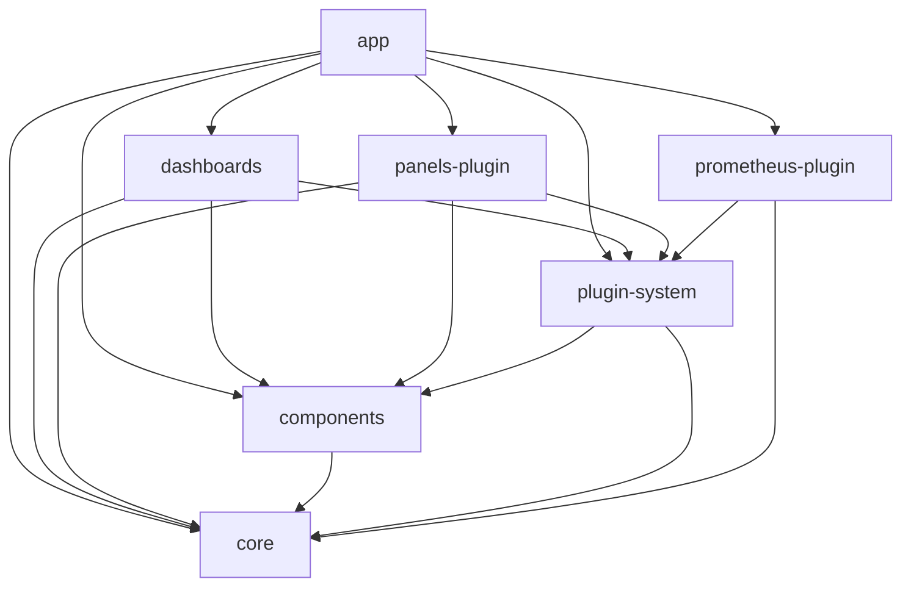

# Perses UI

This serves as the monorepo root for the packages that make up the Perses UI.
Currently, those packages consist of:

- [`app`](./app): The main Perses UI React application.
- [`components`](./components): common components available to the app, plugins, or users who want to embed common Perses UI elements into their own applications
- [`core`](./core): Core functionality that's exposed to plugins and also
  consumed by the app
- [`panels-plugin`](./panels-plugin): a plugin module with `Panel` plugins for
  the core visualizations supported by Perses.
- [`plugin-system`](./plugin-system): All the type definitions and components that power our plugins, also includes the definitions for the runtime available to plugins (e.g. the current time range state, the current template variable state)
- [`prometheus-plugin`](./prometheus-plugin): a plugin module with multiple
  plugin types (e.g. `Variable`, `ChartQuery`, etc.) for supporting Prometheus
  in Perses

The root `package.json` in this folder has
[NPM workspaces](https://docs.npmjs.com/cli/v7/using-npm/workspaces) enabled,
so running `npm install` will install dependencies for all packages and add
symlinks to the local versions for packages that depend on other packages in
the workspace. The root `package.json` also contains `devDependencies` that
are commonly used across multiple packages in the workspace.

## Development Environment

First, check out the [UI Guidelines](./ui-guidelines.md) for some information
on how the codebase is organized and our approach to development in the UI.
You'll need to have the following installed locally before you can start
developing:

- [Node.js](https://nodejs.org/) v16 or higher: we suggest using [NVM](https://github.com/nvm-sh/nvm) for installing
  and managing versions
- [NPM](https://npmjs.com/) v7 or higher: a version of `npm` that supports workspaces (use
  `npm --version` to check your version locally)

## Running Scripts

You can use the `-w ${WORKSPACE_NAME}` flag of `npm run` to run scripts inside
workspace packages from this root folder. For example, to start the main app,
you would run:

```sh
npm run start -w app
```

Keep in mind that since `npm install` symlinks to other local packages in the
workspace, you may need to build some packages first locally before they will
be available to the local packages that depend on them (e.g. you need to build
`core` before building/running `app` locally).

You can also run a script across all packages in the workspace using NPM's
`--workspaces` flag.

## Library Architecture Diagram

Perses is broken up in to a number of separate packages to allow for flexibility when embedding functionality. Below is the current structure of these libraries:


